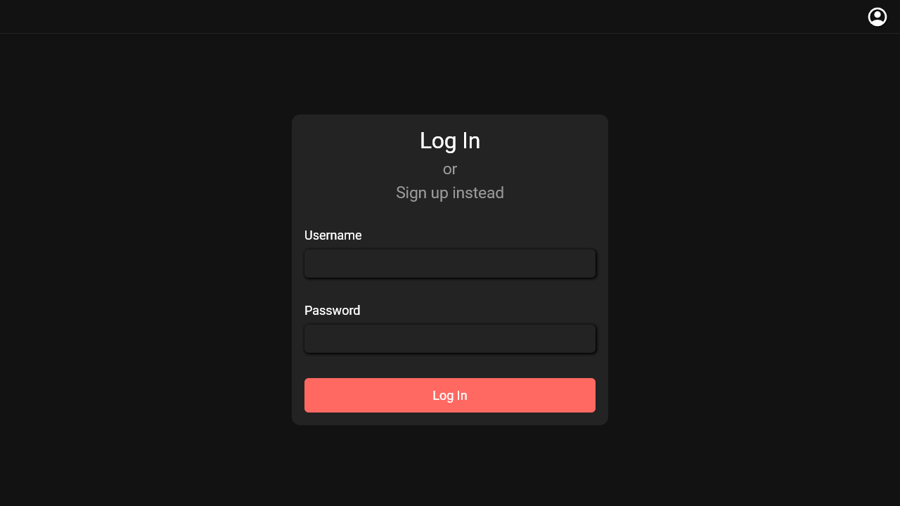
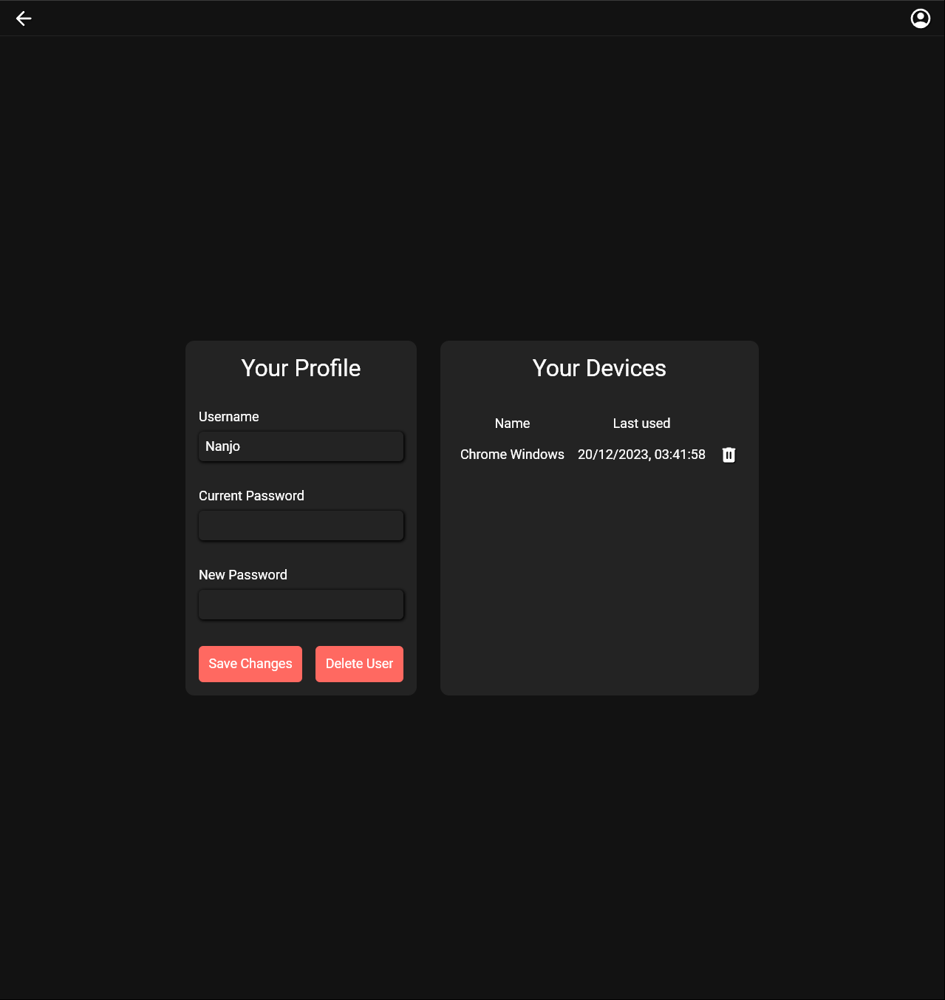
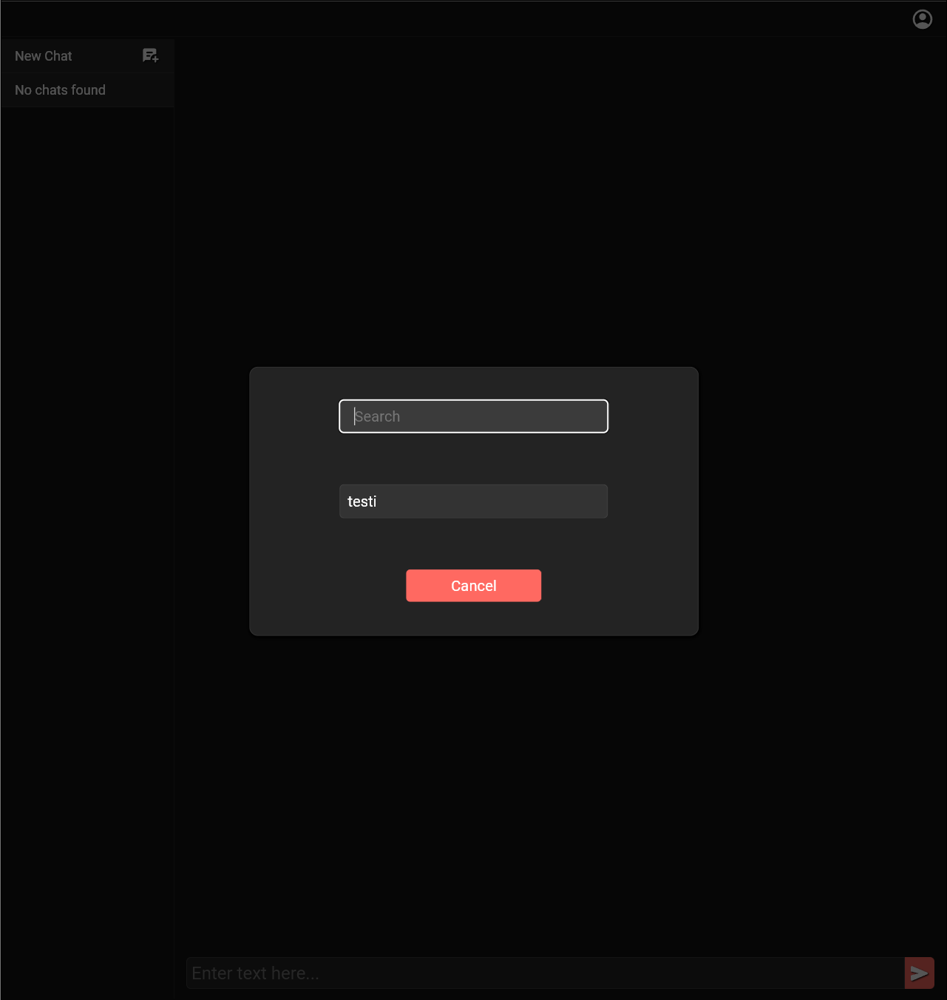
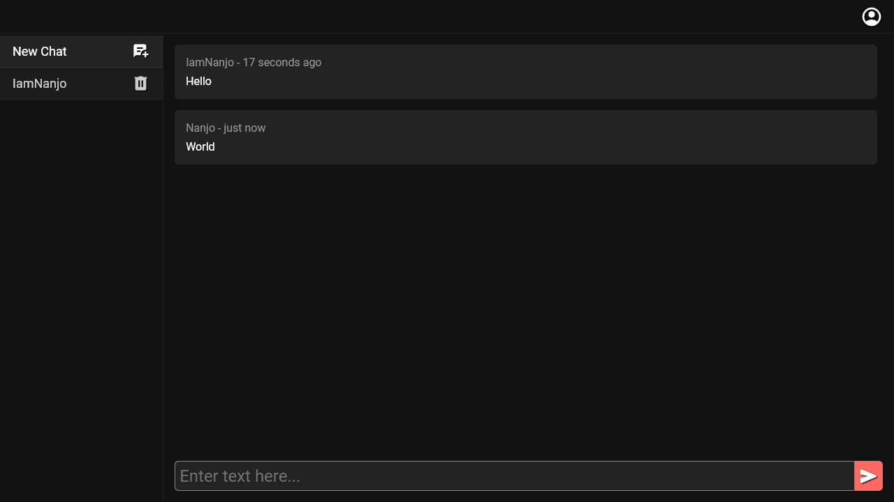

# Encrypted Chat App

This chat app uses end-to-end-encryption with RSA-OAEP.
The encryption is done on the client using the Web Crypto API.
The encrypted messages and public keys are saved on the server and they are then sent to users.

New chats and messages are sent to clients using Websockets. This means that only the new messages need to be decrypted and there will be no need to constantly poll the server for updates. This makes the chat app far more performant efficient.

~~New messages are fetched using polling.
In a future update the app will use Websockets instead of polling for faster updates and less unnecessary requests.
This will also allow only decrypting new messages instead of the whole list every time, making the app far more efficient.~~

## Screenshots









## Setup

Make sure to install the dependencies:

```bash
# npm
npm install

# yarn
yarn install

# bun
bun install
```

### Database Setup

```bash
# npm
npm run dbinit
npm run dbgenerate

# yarn
yarn dbinit
yarn dbgenerate

# bun
bun dbinit
bun dbgenerate
```

### Development Server

Start the development server on `http://localhost:3000`:

```bash
# npm
npm run dev

# yarn
yarn dev

# bun
bun dev
```

### Production

Build the application for production:

```bash
# npm
npm run build

# yarn
yarn build

# bun
bun run build
```

Locally preview production build:

```bash
# npm
npm run preview

# yarn
yarn preview

# bun
bun preview
```

Serve the production build using PM2:

```bash
# npm
npm run start

# yarn
yarn start

# bun
bun start
```
